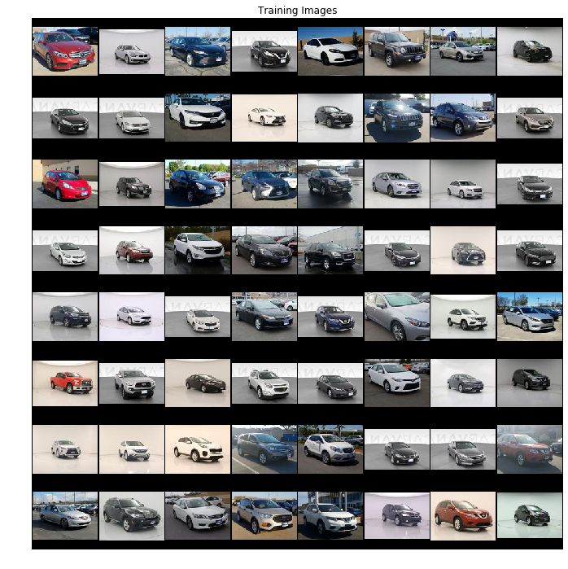
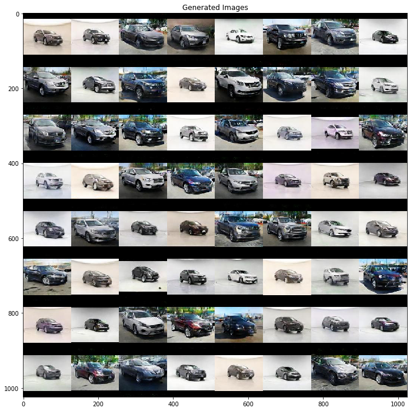

# Car Design Generation with DCGANs
For an in-depth article of this project, go to https://medium.com/@alisoomar/adversarial-networks-for-car-image-generation-9bdf5977bec8

In this project, we generated images of new car models through Deep Convolutional General Adversarial Networks (DCGANs). We wanted to explore the possibilities of generative networks by trying to create new marketable products, and we decided on cars as we found good amounts of scrapable data online. After gathering our data, we trained and tested different models, learning how to avoid many different GAN issues that lead to unusable results. Then, we explored different standard GAN problems like inpainting and image restoration. Finally, we suggest where changes and improvements could be made to our project if someone were to further explore the field.

Below shows the evolution of the images generated by our DCGAN from 70 epochs

Below are the training images used for our DCGAN. The images used are 128x128, and includes vehicles all facing the same angle. The images were obtained from Carvana and Carmax.

Below are the final results after training our DCGAN for 170 epochs. Training beyond this can potentially yield even better images with greater detail.

# Usage
This section explains how to replicate our results and to use our DCGAN on your own training set. This DCGAN was implemented using PyTorch.

For collecting the images, you can download all the images located in `final_data.csv` by utilizing the python notebooks in the `data_processing` directory. Do this at your own discretion, as the scraping was done only for educational purposes and for exploratory data analysis. If you want to use your own training set, ensure that your images are 128x128 resolution. Our training set included a total of 59,816 images.

In order to start training, follow the instructions in the comments of `CarGan128_SELU.py`. Additionally, when specifying where your training set directory is, ensure the structure is the following, `specified_directory/inner_directory/training_set`. To train efficiently, it is important to note that a fairly powerful GPU is needed. To obtain our results, we used Paperspace Gradient (Cloud GPU Provider) with the P5000 GPU. It took about 13 hours for 170 epochs. If you are new to using cloud GPUs, we highly recommend using Paperspace, as it is pretty easy to use and it is fairly cheap. If you want a tutorial on how to use Paperspace, you can take a look at https://youtu.be/hqLJhrgqrB4

## References
[1] https://pytorch.org/tutorials/beginner/dcgan_faces_tutorial.html

[2] https://towardsdatascience.com/image-generator-drawing-cartoons-with-generative-adversarial-networks-45e814ca9b6b

[3] https://towardsdatascience.com/face-generator-generating-artificial-faces-with-machine-learning-9e8c3d6c1ead

[4]https://sites.skoltech.ru/app/data/uploads/sites/25/2018/04/deep_image_prior.pdf

[5] https://ajolicoeur.wordpress.com/cats/

[6] https://github.com/AshishBora/csgm

[7] https://users.ece.utexas.edu/~dimakis/Dimakis_TexasAI.pdf

[8] https://hackernoon.com/binary-face-classifier-using-pytorch-2d835ccb7816

[9] https://pytorch.org/tutorials/beginner/blitz/cifar10_tutorial.html
